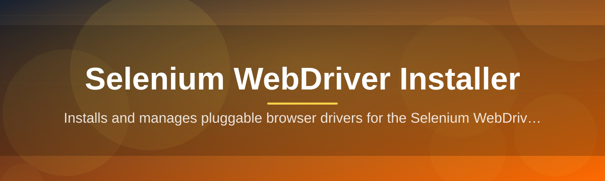
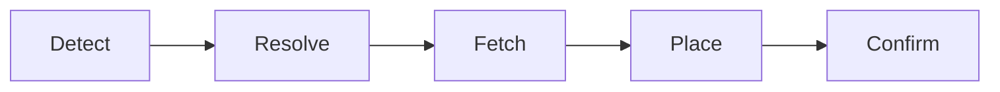

# selenium-webdriver-installer-tool 🧩🚀

  

*One click. Every browser driver, matched, downloaded, and pathed — automatically.*

  

## 🔎 Overview

Anyone who has automated a browser knows the drill: Chrome updates itself overnight, your `chromedriver` binary silently falls one version behind, and suddenly your entire test suite throws a cryptic `SessionNotCreatedException`. **selenium-webdriver-installer-tool** exists to end that cycle. It's a lightweight Windows utility that detects the browsers installed on your machine, resolves the exact driver version each one needs, and installs everything into a clean, predictable location — no spreadsheet of version numbers required.

This tool sits at the unglamorous but critical layer of browser automation: **driver management**. Whether you're running Selenium WebDriver for QA regression suites, scraping pipelines, or CI smoke tests, the installer removes the manual lookup-download-unzip-path ritual that eats up more time than it should. It's built for QA engineers, automation framework maintainers, and solo developers who just want their WebDriver session to launch on the first try.

Under the hood, it speaks the same version-matching language that Selenium Manager and browser vendors use, but wraps it in a friendly desktop experience — so you get the reliability of a command-line resolver with the comfort of a GUI you can actually glance at.

---

## ✨ What It Actually Does

1. **Auto-detects installed browsers** — scans your system for Chrome, Firefox, Edge, and Brave, reading their real version strings instead of guessing.

2. **Matches drivers precisely** — pulls the correct ChromeDriver, GeckoDriver, or Edge WebDriver build that lines up with your exact browser version, down to the patch number.

3. **One-click driver refresh** — when a browser silently auto-updates, a single button re-syncs every driver so your automation scripts stop breaking overnight.

4. **Smart PATH management** — writes driver locations to your environment variables cleanly, with an option to keep everything sandboxed in a local project folder instead.

5. **Multi-browser profiles** — save named driver sets (e.g. "CI-Chrome-Stable", "Legacy-Edge") and switch between them without reinstalling anything.

6. **Offline cache mode** — once downloaded, drivers are cached locally so you can reinstall or roll back versions without hitting the network again.

7. **Version pinning** — lock a driver to a specific release when a newer build breaks your test suite, and get notified before it auto-updates past that pin.

8. **Built-in integrity checks** — every downloaded binary is checksum-verified before it touches your filesystem.

> [!TIP]
> Run the **Auto-Detect** scan first before touching any manual settings — it saves you from picking the wrong architecture (x86 vs x64) by hand.

---

## 🏁 Getting Rolling

1. **Visit the landing page** using the download button above — that's the only official source for the tool.

2. **Download the installer** — it's a single standalone `.exe`, no bundled installers or third-party wizards.

3. **Run it** — Windows SmartScreen may flag it as unrecognized on first launch; click "More info" → "Run anyway" since it's an unsigned indie build.

4. **Let it scan** — the tool detects your browsers automatically and suggests the matching drivers. Confirm, and you're done.

> [!NOTE]
> No restart is required. Drivers become available to your terminal or IDE the moment the install finishes.

---

## 🖥️ System Requirements

| Requirement | Detail |
|---|---|
| **OS** | Windows 10 (64-bit) or Windows 11 |
| **Disk space** | ~150 MB free (drivers are small, cache grows over time) |
| **Dependencies** | None — fully standalone, no .NET or Python runtime needed |
| **Admin rights** | Not required for user-scope installs; recommended for system-wide PATH edits |
| **Network** | Required only during driver downloads; fully offline afterward |

  

---

## ⚙️ How It Works

The core logic follows a simple resolve-and-fetch pipeline every time you launch a scan:

1. **Detect** — the tool queries installed browser registry keys and executable metadata.

2. **Resolve** — it maps each detected version to the matching WebDriver release using vendor version manifests.

3. **Fetch** — the correct binary is downloaded (or pulled from local cache) and checksum-verified.

4. **Place** — the driver lands in your chosen directory and gets registered on PATH.

5. **Confirm** — a final handshake test launches a headless session to confirm the driver actually starts.

> [!IMPORTANT]
> The **Confirm** step is what separates this tool from a plain downloader — it actually launches a throwaway WebDriver session to prove the binary works before calling the install "done."

---

## 🩹 Troubleshooting

**Q: The tool says "Browser version not recognized" — what now?**
A: This usually means you're on a beta or canary build. Enable **Show experimental channels** in Settings to unlock matching drivers for those tracks.

**Q: My antivirus quarantined the download.**
A: Unsigned standalone `.exe` files often trigger heuristic flags. Whitelist the download folder or check the project's community discussion for the current file hash to verify authenticity.

**Q: Selenium still throws a version mismatch after installing.**
A: Your IDE or terminal may be caching an old PATH entry. Close and reopen the terminal session, or reboot if it's a system-wide install.

**Q: Can I install drivers for a browser version I don't currently have installed?**
A: Yes — use **Manual Version Select** in the sidebar to pick any released driver version independent of what's detected locally.

**Q: The offline cache is taking up too much space.**
A: Open **Settings → Cache → Clear Old Versions**, which keeps only the two most recent driver builds per browser.

**Q: Edge WebDriver keeps failing to launch.**
A: Edge ties its driver tightly to the Chromium build number — run a fresh **Auto-Detect** scan after any Edge update, since Microsoft ships silent updates more aggressively than Chrome.

---

## 🎨 UI, Shortcuts & Personalization

<strong>Keyboard shortcuts</strong>

| Shortcut | Action |
|---|---|
| `Ctrl + R` | Re-run browser detection scan |
| `Ctrl + Shift + P` | Open driver profile switcher |
| `Ctrl + L` | Jump to install log |
| `Ctrl + ,` | Open Settings |
| `Esc` | Cancel active download |

<strong>Themes & appearance</strong>

- **Light** and **Dark** modes, plus a **Follow System** auto-switch

- A compact "Tray Mode" that minimizes the tool to the notification area between scans

- Adjustable log verbosity: Quiet, Normal, Verbose

> Settings persist per-user in a local config file — nothing is synced to the cloud, and nothing phones home beyond the driver download itself.

---

## 🤝 Contributing & Community

This project grows through the people who actually run WebDriver sessions daily. Contributions are welcome in the form of:

- Bug reports with your browser version + Windows build number

- Pull requests for additional browser/driver support

- Documentation fixes — typos, unclear steps, missing edge cases

- Feature discussions in the community forum linked from the landing page

> [!WARNING]
> Please avoid submitting driver binaries directly in issues or PRs — link to the official vendor source instead. Keeps the repo clean and the supply chain trustworthy.

---

## 📄 License

Released under the [MIT License](LICENSE), 2026. Use it, fork it, ship it inside your own tooling — just keep the license notice intact.

---

## ⚠️ Disclaimer

This tool automates the download of third-party WebDriver binaries published by browser vendors (Google, Mozilla, Microsoft). It is an independent, community-maintained utility and is **not affiliated with or endorsed by** the Selenium project, Google, Mozilla, or Microsoft. Browser and driver trademarks belong to their respective owners. Use at your own discretion, and always verify downloaded binaries in environments where security posture matters.

